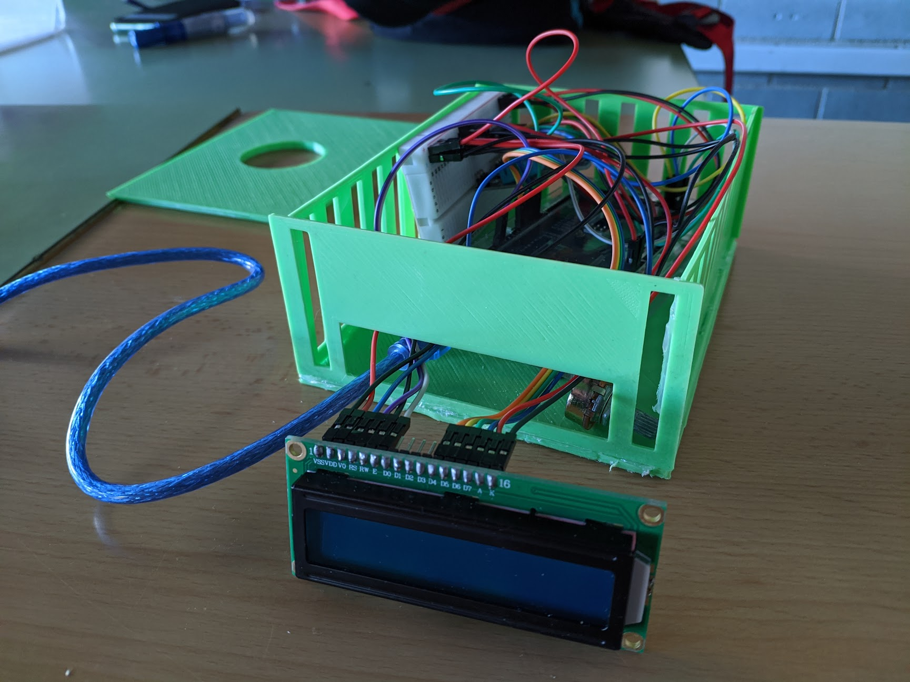

# Estació meteorològica
Estació meteorològica per el treball de recerca de 4t d'ESO

Llibreries fetes servir:  
https://github.com/adafruit/Adafruit_Sensor  
https://github.com/adafruit/DHT-sensor-library  
https://github.com/sparkfun/BMP180_Breakout  
https://github.com/arduino-libraries/LiquidCrystal  
https://github.com/arduino-libraries/SD  

# Arduino MEGA

## DHT 11
VCC | GND | DATA
--- | --- | ---
5V  | GND | 2

## LCD 16x2
VSS | VDD | VEE            | RS | RW  | EN | D4 | D5 | D6 | D7 | LED+ | LED-
--- | --- | ---            | -- | --  | -- | -- | -- | -- | -- | ---- | ----
GND | 5V  | Potenciomentre | 12 | GND | 11 | 6  | 5  | 4  | 3  | 5V   | GND

## BMP 180
VCC | GND | SCL | SDA
--- | --- | --- | ---
5V  | GND | 21  | 20

## SD
VCC | GND | CS | MOSI | SCK | MISO
--- | --- | -- | ---- | --- | ----
5V  | GND | 53 | 51   | 52  | 50